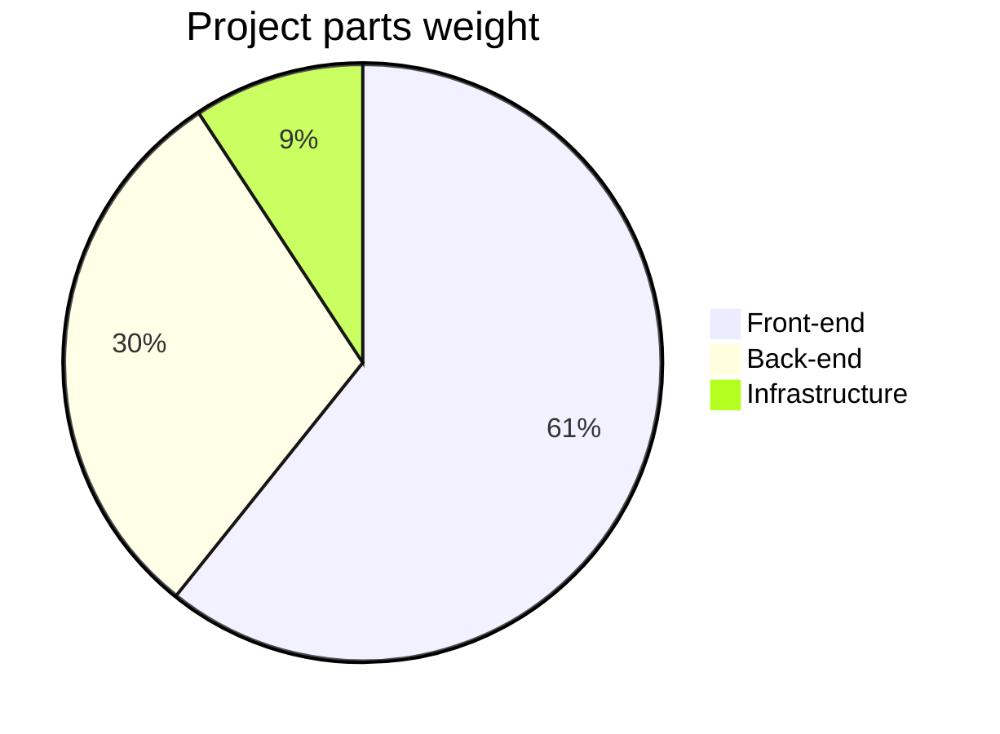
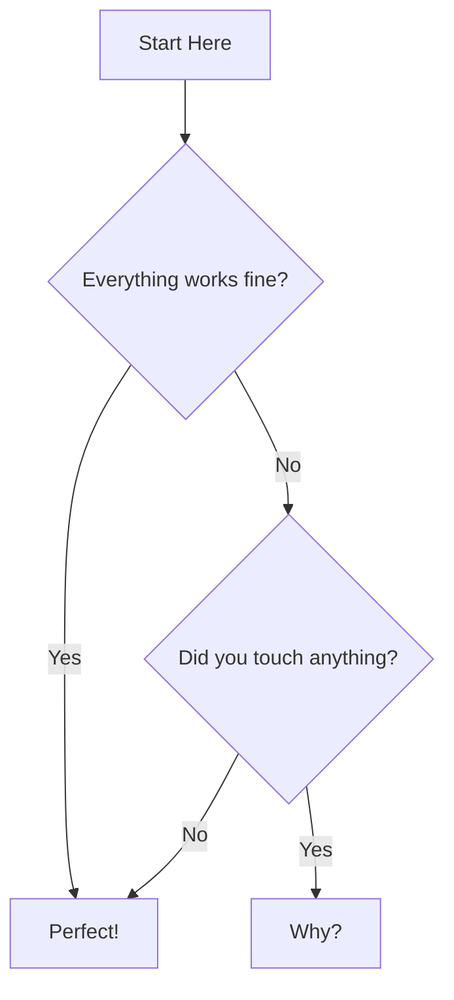

Sample pie diagram

```mermaid
pie 
    title Project parts weight
    "Front-end" : 60.75
    "Back-end" : 30
    "Infrastructure" : 9.25
```

```mermaid
flowchart TD
    A[Start Here] --> B{Everything works fine?}
    B -- Yes --> C[Perfect!]
    B -- No --> D{Did you touch anything?}
    D -- Yes --> E[Why?]
    D -- No --> C
```